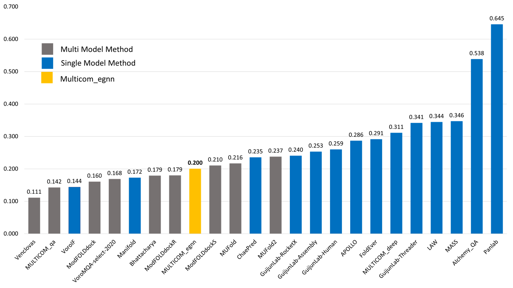
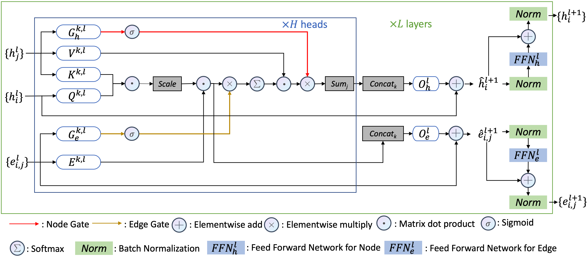

# DProQA: A Gated-Graph Transformer for Protein Complex Structure Assessment

## ISMB2023

Our work has been accpeted by ISMB 2023, [here](https://drive.google.com/file/d/1hLTwlE8deQ1x2_CLbboo07omNcyVdHQi/view?usp=sharing) is the latest manuscirpt.

## CASP15 result

In terms of TMscore ranking loss, DProQA (team: MULTICOM_egnn) ranked 9th among all 26 methods and **3rd** place among all single-model methods.


------------------------
DProA, is a Gated-Graph Transformer model for  end-to-end protein complex structure's quality evaluation. DProQA achieves significant speed-ups and better quality compared to current baseline method. If you have any questions or suggestions, please contact us by  <xcbh6@umsystem.edu>. We are happy to help!




# Citation

If you think our work is helpful, please cite our work by:

```
@article {Chen2022.05.19.492741,
    author = {Chen, Xiao and Morehead, Alex and Liu, Jian and Cheng, Jianlin},
    title = {DProQ: A Gated-Graph Transformer for Protein Complex Structure Assessment},
    elocation-id = {2022.05.19.492741},
    year = {2022},
    doi = {10.1101/2022.05.19.492741},
    publisher = {Cold Spring Harbor Laboratory},
    URL = {https://www.biorxiv.org/content/early/2022/05/20/2022.05.19.492741},
    eprint = {https://www.biorxiv.org/content/early/2022/05/20/2022.05.19.492741.full.pdf},
    journal = {bioRxiv}
}
```

# Dataset
## Benchmark sets

We provide our benchmark tests HAF2 and DBM55-AF2 for download by:

```bash
wget https://zenodo.org/record/6569837/files/DproQ_benchmark.tgz
```

Each dataset contains:

1. `decoy` folder: decoys files
2. `native` folder: native structure files
3. `label_info.csv`: DockQA scores and CAPRI class label

# Installation

1. Download this repository
   
   ```bash
   git clone https://github.com/jianlin-cheng/DProQA.git
   ```

2. Set up conda environment locally
   
   ```bash
   cd DProQA
   conda env create --name DProQA -f environment.yml
   ```

3. Activate conda environment
   
   ```bash
   conda activate DProQA
   ```

# Usage

Here is the inference.py script parameters' introduction.

```bash
python inference.py
-c --complex_folder     Raw protien complex complex_folder
-w --work_dir           Working directory to save all intermedia files and folders, it will created if it is not exits
-r --result_folder      Result folder to save two ranking results, it will created if it is not exits
-r --threads            Number of threads for parallel feature generation and dataloader, default=10
-s --delete_tmp         Set False to save work_dir and intermedia files, otherwise set True, default=False
```

# Use provided model weights to predict protein complex structures' quality

**DProQA requires GPU**. We provide few protein complexes in `example` folder for test. The evaluation result Ranking.csv is stored in result_folder.

```bash
python ./inference.py -c ./examples/6AL0/ -w ./examples/work/ -r ./examples/result
```

You can build you onw dataset for evaluation, the data folder should look like:

```bash
customer_data_folder
├── decoy_1.pdb
├── decoy_2.pdb
├── decoy_3.pdb
├── decoy_4.pdb
└── decoy_5.pdb
```
