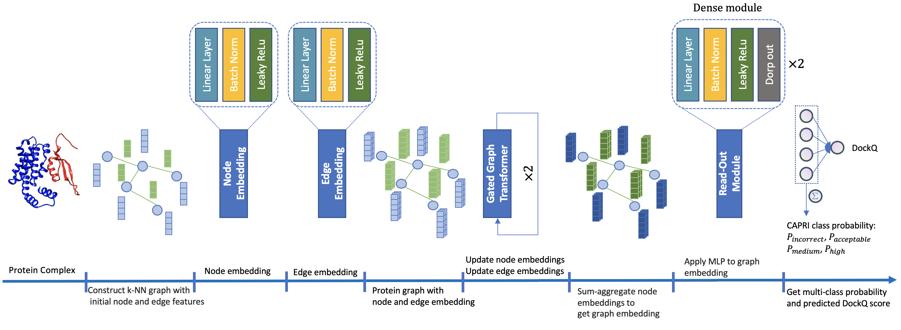
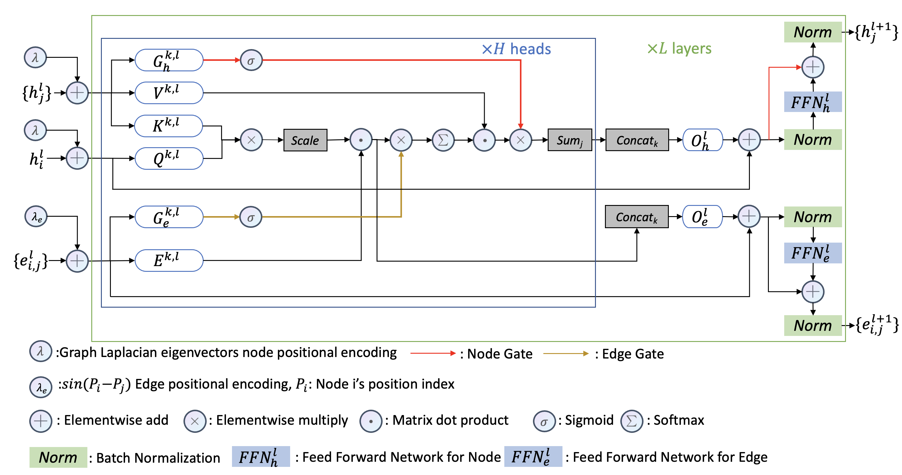

# DProQA: A Gated-Graph Transformer for Protein Complex Structure Assessment

[DProQA](https://www.biorxiv.org/content/early/2022/05/20/2022.05.19.492741), is a Gated-Graph Transformer model for 
end-to-end protein complex structure's quality evaluation. DProQA achieves significant speed-ups and better quality 
compared to current baseline method. If you have any questions or suggestions, please contact us by  <xcbh6@umsystem.edu>
. We are happy to help!





# Citation

If you think our work is helpful, please cite our work by:

```
@article {Chen2022.05.19.492741,
    author = {Chen, Xiao and Morehead, Alex and Liu, Jian and Cheng, Jianlin},
    title = {DProQ: A Gated-Graph Transformer for Protein Complex Structure Assessment},
    elocation-id = {2022.05.19.492741},
    year = {2022},
    doi = {10.1101/2022.05.19.492741},
    publisher = {Cold Spring Harbor Laboratory},
    URL = {https://www.biorxiv.org/content/early/2022/05/20/2022.05.19.492741},
    eprint = {https://www.biorxiv.org/content/early/2022/05/20/2022.05.19.492741.full.pdf},
    journal = {bioRxiv}
}
```

# Dataset
## Benchmark sets

We provide our benchmark tests HAF2 and DBM55-AF2 for download by:

```bash
wget https://zenodo.org/record/6569837/files/DproQ_benchmark.tgz
```

Each dataset contains:

1. `decoy` folder: decoys files
2. `native` folder: native structure files
3. `label_info.csv`: DockQA scores and CAPRI class label

# Installation

1. Download this repository
   
   ```bash
   git clone https://github.com/BioinfoMachineLearning/DProQA.git
   ```

2. Set up conda environment locally
   
   ```bash
   cd DProQA
   conda env create --name DProQA -f environment.yml
   ```

3. Activate condaA environment
   
   ```bash
   conda activate DPRoQA
   ```

# Usage

Here is the inference.py script parameters' introduction.

```bash
python inference.py
-c --complex_folder     Raw protien complex complex_folder
-w --work_dir           Working directory to save all intermedia files and folders, it will created if it is not exits
-r --result_folder      Result folder to save two ranking results, it will created if it is not exits
-r --threads            Number of threads for parallel feature generation and dataloader, default=10
-s --delete_tmp         Set False to save work_dir and intermedia files, otherwise set True, default=False
```

# Use provided model weights to predict protein complex structures' quality

**DProQA requires GPU**. We provide few protein complexes in `example` folder for test. The evaluation result Ranking.csv is stored in result_folder.

```bash
python ./inference.py -c ./examples/6AL0/ -w ./examples/work/ -r ./examples/result
```

You can build you onw dataset for evaluation, the data folder should look like:

```bash
customer_data_folder
├── decoy_1.pdb
├── decoy_2.pdb
├── decoy_3.pdb
├── decoy_4.pdb
└── decoy_5.pdb
```

# Main results

Following four tables show DProQ's consistent **best** result on HAF2 and DBM55-AF2 test sets in terms of *hit rate* and 
*ranking loss*.

## HAF2  test set

Table 1: Hit rate performance on the HAF2 dataset. The Best column represents each target’s best-possible Top-10 result. The Summary
row lists the results when all targets are taken into consideration. -: GOAP failed on these targets due to the large sequence length.

| Target  | DProQA   | DProQA_GT | DProQA_GTE | DProQA_GTN | GOAP      | ZRANK2   | GNN_DOVE | BEST     |
|---------|----------|-----------|------------|------------|-----------|----------|----------|----------|
| 7AOH    | 10/10/10 | 10/10/10 | 10/10/10   | 10/10/10   | -         | 10/10/10 | 9/9/0    | 10/10/10 |
| 7D7F    | 0/0/0    | 0/0/0     | 0/0/0      | 0/0/0      | 2/0/0     | 4/0/0    | 0/0/0    | 5/0/0    |
| 7AMV    | 10/10/10 | 10/10/10 | 10/10/10   | 10/10/10   | -         | 10/10/10 | 10/10/6  | 10/10/10 |
| 7OEL    | 10/10/0 | 10/9/0    | 10/10/0    | 10/10/0   | 10/9/0    | 10/10/0  | 10/10/0 | 10/10/0  |
| 7028    | 10/10/0 | 10/10/0  | 10/10/0    | 10/10/0   | 10/10/0  | 10/10/0  | 10/10/0 | 10/10/0  |
| 7ALA    | 0/0/0    | 0/0/0     | 0/0/0      | 0/0/0      | 0/0/0     | 0/0/0    | 0/0/0    | 1/0/0    |
| 7MRW    | 5/4/0    | 0/0/0    | 0/0/0      | 0/0/0      | -         | 10/10/0  | 0/0/0    | 10/10/0  |
| 7OZN    | 0/0/0    | 0/0/0    | 0/0/0      | 0/0/0      | 0/0/0    | 0/0/0    | 0/0/0    | 10/2/0   |
| 7D3Y    | 2/0/0    | 5/0/0     | 6/0/0      | 8/0/0      | 2/0/0     | 2/0/0    | 0/0/0    | 10/0/0   |
| 7NKZ    | 10/10/2  | 10/10/1   | 10/10/1    | 10/10/4    | 10/10/10 | 10/10/10 | 10/9/9   | 10/10/10 |
| 7LXT    | 1/1/0    | 0/0/0     | 0/0/0      | 0/0/0      | 8/8/0     | 8/8/0    | 1/0/0    | 10/10/0  |
| 7KBR    | 10/10/10 | 10/10/10 | 10/10/10   | 10/10/10   | 10/10/10 | 10/10/9  | 10/10/9  | 10/10/10 |
| 7O27    | 10/10/0 | 10/10/0  | 10/10/0    | 10/10/0    | 10/10/0  | 10/10/0  | 10/4/0   | 10/10/0  |
| SUMMARY | 10/9/4   | 8/7/4     | 8/7/4      | 8/7/4      | N/A       | 11/9/4   | 8/7/3    | 13/10/4  |

Table 2: Ranking loss performance on the HAF2 dataset. The BEST row represents the mean and standard deviation of the ranking losses
for all targets. -: GOAP failed on these targets due to the large sequence length.

| Target | DPrOQA       | DProQA_GT    | DProQA_GTE  | DProQA_GTN   | GOAP   | ZRANK2       | GNN_DOVE     |
|--------|--------------|--------------|-------------|--------------|--------|--------------|--------------|
| 7AOH   | 0.066        | 0.026        | 0.026       | 0.058        | -      | 0.037        | 0.928        |
| 7D7F   | 0.471        | 0.471        | 0.47        | 0.471        | 0.471  | 0.470        | 0.003        |
| 7AMV   | 0.01         | 0.021        | 0.017       | 0.019        | -      | 0.01         | 0.342        |
| 7OEL   | 0.062        | 0.063        | 0.135       | 0.135        | 0.189  | 0.123        | 0.21         |
| 7D28   | 0.029        | 0.021        | 0.027       | 0.034        | 0.027  | 0.0          | 0.244        |
| 7ALA   | 0.232        | 0.226        | 0.226       | 0.226        | 0.234  | 0.159        | 0.226        |
| 7MRW   | 0.085        | 0.603        | 0.555       | 0.555        | -      | 0.061        | 0.598        |
| 7DZN   | 0.409        | 0.409        | 0.49        | 0.281        | 0.411  | 0.08         | 0.457        |
| 7D3Y   | 0.326        | 0.33         | 0.012       | 0.326        | 0.266  | 0.304        | 0.295        |
| 7NKZ   | 0.164        | 0.175        | 0.175       | 0.164        | 0.012  | 0.019        | 0.459        |
| 7LXT   | 0.586        | 0.586        | 0.586       | 0.586        | 0.052  | 0.0          | 0.295        |
| 7KBR   | 0.068        | 0.152        | 0.152       | 0.17         | 0.104  | 0.025        | 0.068        |
| 7027   | 0.03         | 0.079        | 0.079       | 0.079        | 0.033  | 0.038        | 0.334        |
| SUMMARY| 0.195±0.185 | 0.243±0.206 | 0.227±0.21 | 0.239±0.187 | N/A    | 0.102±0.018 | 0.343±0.228 |

## DBM55-AF2 test set

Table 3: Hit rate performance on DBM55-AF2 dataset. The BEST column represents each target’s best-possible Top-10 result.
The SUMMARY row lists the results when all targets are taken into consideration.

| Target  | DPROQA  | DPROQA_GT | DPROQA_GTE | DPROQA_GTN | GOAP    | ZRANK2  | GNN_DOVE | BEST    |
|---------|---------|-----------|------------|------------|---------|---------|----------|---------|
| 6ALO    | 9/2/0   | 10/0/0    | 10/0/0     | 10/2/0     | 6/0/0   | 9/0/0   | 9/0/0    | 10/2/0  |
| 3SE8    | 8/8/0   | 9/9/0     | 8/8/0      | 8/8/0      | 3/0/0   | 8/8/0   | 2/2/0    | 10/10/0 |
| 5GRJ    | 10/10/0 | 9/9/0     | 10/10/0    | 9/9/0      | 3/2/0   | 10/9/0  | 5/4/0    | 10/10/0 |
| 6A77    | 7/7/0   | 7/7/0     | 8/8/0      | 8/8/0      | 0/0/0   | 3/3/0   | 4/4/0    | 8/8/0   |
| 4M5Z    | 10/10/1 | 10/10/0   | 10/10/0    | 10/10/0    | 10/10/0 | 10/10/1 | 10/10/1  | 10/10/1 |
| 4ETQ    | 1/1/0   | 1/1/0     | 1/1/0      | 1/1/0      | 0/0/0   | 1/1/0   | 1/1/0    | 1/1/0   |
| 5CBA    | 10/10/1 | 10/10/0   | 10/10/0    | 10/10/1    | 10/10/3 | 10/10/2 | 10/10/4  | 10/10/6 |
| 5WK3    | 0/0/0   | 0/0/0     | 0/0/0      | 0/0/0      | 1/0/0   | 0/0/0   | 3/0/0    | 3/0/0   |
| 5Y9J    | 4/0/0   | 6/0/0     | 5/0/0      | 4/0/0      | 0/0/0   | 5/0/0   | 5/0/0    | 8/0/0   |
| 6BOS    | 10/10/0 | 10/10/0   | 10/10/0    | 10/10/0    | 10/10/0 | 10/10/0 | 10/10/0  | 10/10/0 |
| 5HGG    | 8/0/0   | 8/0/0     | 8/0/0      | 8/0/0      | 8/0/0   | 10/0/0  | 10/0/0   | 10/0/0  |
| 6AOZ    | 0/0/0   | 0/0/0     | 0/0/0      | 0/0/0      | 2/0/0   | 0/0/0   | 0/0/0    | 3/0/0   |
| 3U7Y    | 2/2/1   | 2/2/1     | 2/2/1      | 2/1/0      | 2/2/1   | 2/2/1   | 1/1/1    | 2/2/1   |
| 3WD5    | 10/8/0  | 9/8/0     | 9/8/0      | 9/8/0      | 0/0/0   | 10/8/0  | 6/4/0    | 10/10/0 |
| 5KOV    | 0/0/0   | 0/0/0     | 0/0/0      | 0/0/0      | 1/0/0   | 1/0/0   | 0/0/0    | 2/0/0   |
| SUMMARY | 12/10/3 | 12/9/1    | 12/9/1     | 12/10/1    | 13/9/3  | 13/10/3 | 10/4/1   | 15/10/3 |

Table 4: Ranking loss performance on the DBM55-AF2 dataset. The BEST row represents the mean and standard deviation of
the ranking losses for all targets.


| Target | DPROQA      | DProQA_GT   | DPROQA_GTE  | DPROQA_GTN  | GOAP        | ZRANK2      | GNN_DOVE    |
|--------|-------------|-------------|-------------|-------------|-------------|-------------|-------------|
| 6ALO   | 0.0         | 0.156       | 0.156       | 0.0         | 0.331       | 0.016       | 0.424       |
| 3SE8   | 0.079       | 0.041       | 0.041       | 0.079       | 0.0         | 0.677       | 0.735       |
| 5GRJ   | 0.024       | 0.012       | 0.095       | 0.012       | 0.23        | 0.757       | 0.776       |
| 6A77   | 0.037       | 0.062       | 0.0         | 0.037       | 0.59        | 0.539       | 0.591       |
| 4M5Z   | 0.015       | 0.026       | 0.026       | 0.015       | 0.133       | 0.221       | 0.221       |
| 4ETQ   | 0.0         | 0.76        | 0.0         | 0.748       | 0.0         | 0.759       | 0.759       |
| 5CBA   | 0.052       | 0.038       | 0.052       | 0.058       | 0.007       | 0.047       | 0.019       |
| 5WK3   | 0.114       | 0.114       | 0.114       | 0.186       | 0.109       | 0.0         | 0.087       |
| 5Y9J   | 0.0         | 0.0         | 0.0         | 0.0         | 0.0         | 0.027       | 0.382       |
| 6BOS   | 0.081       | 0.081       | 0.0         | 0.0         | 0.09        | 0.006       | 0.081       |
| 5HGG   | 0.051       | 0.051       | 0.121       | 0.051       | 0.051       | 0.051       | 0.121       |
| 6A0Z   | 0.207       | 0.207       | 0.207       | 0.207       | 0.214       | 0.012       | 0.062       |
| 3U7Y   | 0.0         | 0.021       | 0.0         | 0.0         | 0.0         | 0.772       | 0.756       |
| 3WD5   | 0.011       | 0.011       | 0.011       | 0.0         | 0.011       | 0.595       | 0.672       |
| 5KOV   | 0.065       | 0.08        | 0.085       | 0.087       | 0.078       | 0.01        | 0.0         |
| SUMMARY| 0.049±0.054 | 0.111±0.182 | 0.061±0.064 | 0.099±0.185 | 0.123±0.025 | 0.299±0.104 | 0.379±0.298 |
